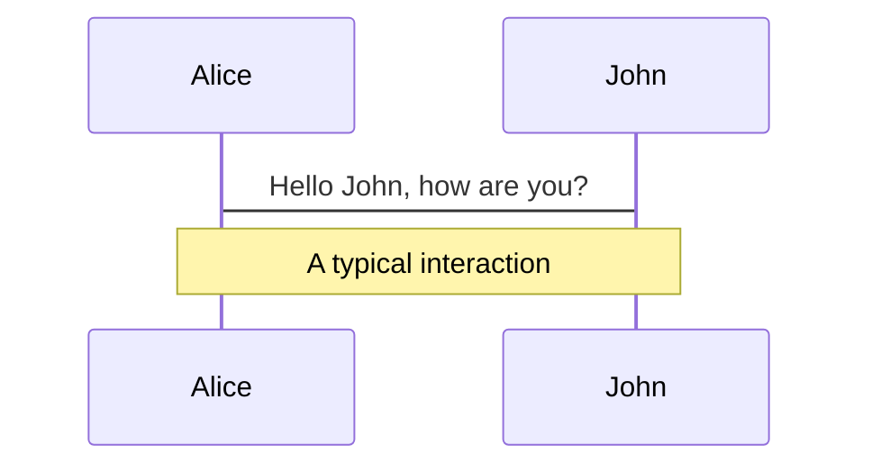

# NSS财务建设

  

    赵强强 | 2025-07
  

---
layout: center
---

# 目录

<Toc text-sm minDepth="1" maxDepth="2" />

---
layout: section
---

# NSS简介

业务介绍，市场拓展

---
layout: section
---

# SF怎么算

计费因子，计费规则，计费单

---
layout: default
---

## Billing Rules

---
layout: section
---

# SF怎么收

收单，结算，账单

---
layout: section
---

# 如何防资损

信息安全，资损防控

---
layout: end
hideInToc: true
---

# 谢谢

Thank You

