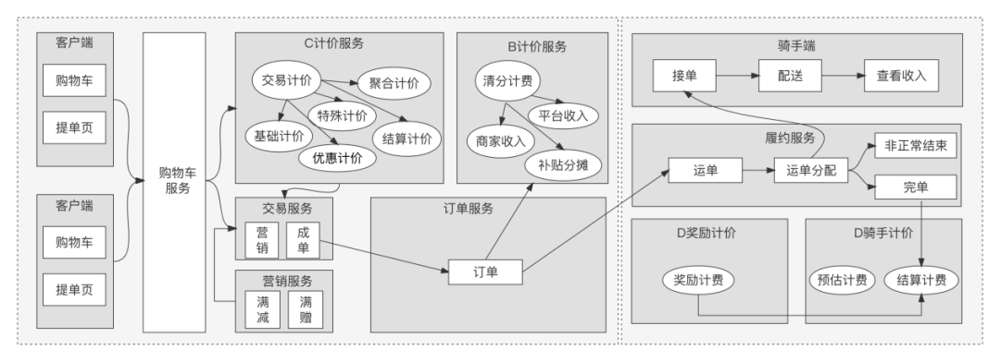

---
# You can also start simply with 'default'
theme: seriph
# random image from a curated Unsplash collection by Anthony
# like them? see https://unsplash.com/collections/94734566/slidev
background: https://unsplash.com/photos/water-splash-in-close-up-photography-SHE_ZiroE0g
# some information about your slides (markdown enabled)
title: Payment and Account Guide
info: |
  ## Slidev Starter Template
  Introduction of Payment and Account.
# apply unocss classes to the current slide
class: text-center
# https://sli.dev/features/drawing
drawings:
  persist: false
# slide transition: https://sli.dev/guide/animations.html#slide-transitions
transition: slide-left
# enable MDC Syntax: https://sli.dev/features/mdc
mdc: true
---
# Introduction of Payment and Account

  Press Space for next page <carbon:arrow-right />

---
transition: fade-out
---

# 支付过程
支付定义：付款人向收款人转移可被双方接受的债权资产。
支付过程可以划分为三个阶段：交易、清算和结算，这是支撑所有支付行为的核心框架。

- 👥 **交易** - 交易是支付的前提，买卖双方只有在完成商品或服务的匹配、价格谈判和合同签订后，才会进入支付环节。
- 💳 **收单** - 调用支付渠道扣除用户款项
- 🏦 **清算** - 是基于已生成的交易单据进行数据交换、归集以及清分的过程。在此过程中，会完成交易本金和手续费的计算，按照对象汇总生成应收应付金额，并通过支付系统将相关信息发送给清算方
- 🧑‍💻 **结算** - 是根据清分结果完成资金最终实际转移的过程
 
 

<!--
You can have `style` tag in markdown to override the style for the current page.
Learn more: https://sli.dev/features/slide-scope-style
-->

<!--
Here is another comment.
-->
---
layout: center
---

# 交易

  

    
  

整个交易过程包括选购、计价和下单等多个环节：

- 📝 **选购** - 从用户进入客户端开始，用户在客户端挑选所需商品，并将选中的商品到添加到购物车中。
- 📝 **下单** - 是指用户将购物车中的商品提交至平台，并进入订单填写页面填写订单相关信息，如收货地址、发票抬头等。
- 📝 **计费** - 在下单过程中，还会涉及计价环节，主要是计算订单的优惠信息以及应付金额（即用户应该支付的总金额）。

---

# 收单结算

  

    
  

收银产品包括收银台产品及对外暴露的接口。重点介绍几种收银台产品:

- 📝 [收银台支付](https://product.shopeepay.com/products/online-payments/checkout-with-shopeepay/) -日常电商购物常见场景，其他变体形式，例如：[Web免登录收银台支付](https://product.shopeepay.com/products/online-payments/link-and-pay/),[二维码扫描支付](https://product.shopeepay.com/products/in-person-payments/merchant-presented-mode/)
- 📝 [代扣/协议支付](https://product.shopeepay.com/products/online-payments/subscription/) - 周期性续费扣款。
- 📝 [预授权支付](https://product.shopeepay.com/products/online-payments/auth-and-capture/) - 比较灵活的扣款方式，运行商户确定扣款时机，但有个提前锁定环节。
---

# 资金流向

  

    
  

  

    
  

资金流向图展示了支付过程中资金的转移路径：

- 📝 **买家支付** - 买家通过支付渠道(如信用卡)向支付平台支付货款
- 📝 **平台结算** - 支付平台在扣除相关费用后，将货款结算给商家
- 📝 **跨境支付** - 对于跨境交易，还需要考虑货币兑换和跨境结算等环节

---

# 参考文献

- [微信平台收付通](https://pay.weixin.qq.com/static/partner_ability/business_payment.shtml)

---

